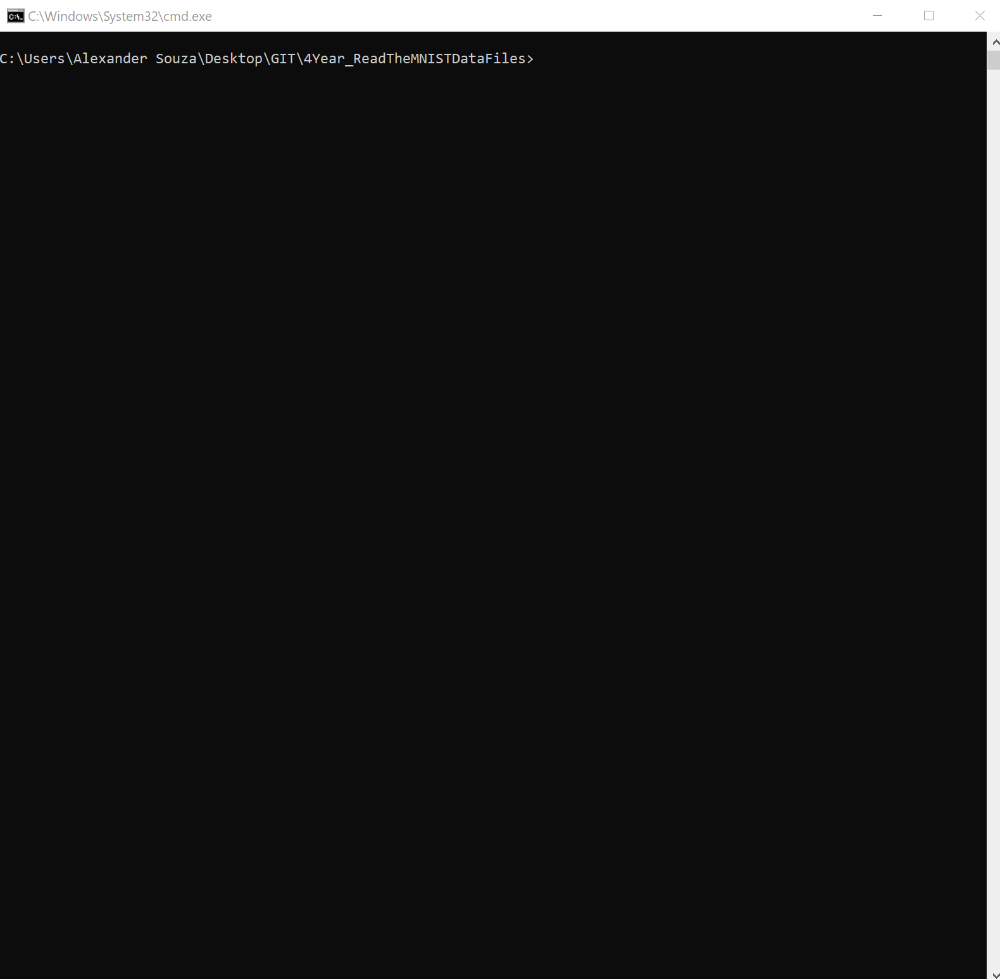

# EMERGING TECHNOLOGIES - Read the MNIST data files

These problems relate to the famous MNIST data set. Save your work as a Python file, or a collection of Python files. 

1. Read the data files

Download the image and label files. Have Python decompress and read them byte by byte into appropriate data structures in memory.

2. Output an image to the console

Output the third image in the training set to the console. Do this by representing any pixel value less than 128 as a full stop and any other pixel value as a hash symbol.

3. Output the image files as PNGs

Use Python to output the image files as PNGs, saving them in a subfolder in your repository. 





# Requirements

## To rum, the code first is necessary take the following steeps:

### Install Anaconda

Anaconda is a freemium open source distribution of the Python and R programming languages for large-scale data processing, predictive analytics, and scientific computing, that aims to simplify package management and deployment.

[More Info...](https://www.anaconda.com/)

[Download and Install](https://www.anaconda.com/download/)

https://www.anaconda.com/download/

### OR

- Having the latest python version. https://www.python.org/downloads/


### Install Git 

https://git-scm.com/downloads


### Create a new directory somewhere, and clone the project by running from cmd:
```
git clone https://github.com/alexpt2000gmit/4Year_ReadTheMNISTDataFiles.git
```


### In command line for windows and Terminal for Mac, type:
```
python 1_Read the data files.py
```


## Author

### Alexander Souza
- G00317835@gmit.ie
- alexpt2000@gmail.com
- github.com/alexpt2000gmit
- github.com/alexpt2000
- www.linkedin.com/in/alexander-souza-3a841539/